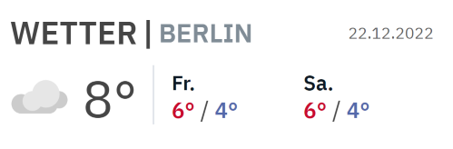

A weather widget that dispays the current temperature with a fitting weather icon and a max/min temp forecast of the next two days.
The opensource API from Deutscher Wetterdienst is used. The weather station of the ID 10384 is located in Berlin-Tempelhof.

Coded in VSC with React.

Currently working on:

- testing different slider carousel solutions before implementation

Planned features (will be reevaluted from time to time)

- A slider carousel to scroll horizontally with clickable arrows for displaying more content
- possible contents are: temperature visualization via a graph, or more detailed weather data like humidity, wind etc.
- location search function

Missing things:

- More weather icons like thunderstorm, wind

Bugs, issues:

- Configuring the headers was not successful so far. For now as a workaround, the browser extension "Allow CORS: Access-Control-Allow-Origin" is used and has to be turned on to display this widget.
  Link: https://microsoftedge.microsoft.com/addons/detail/allow-cors-accesscontro/bhjepjpgngghppolkjdhckmnfphffdag
